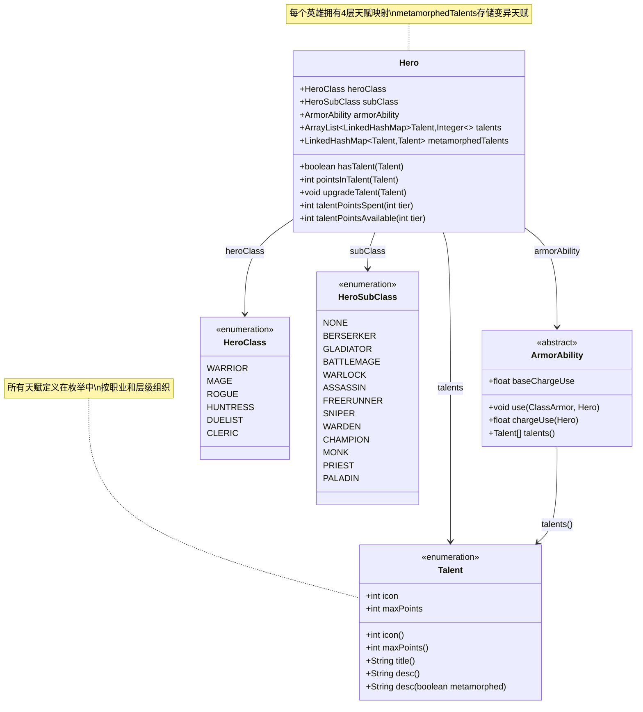

# 天赋系统详解

## 概述

天赋系统是英雄成长的核心机制，为每个职业提供独特的成长路线和战斗风格定制选项。每个职业拥有多层天赋，随着等级提升逐步解锁，玩家可以根据自己的游戏风格选择不同的天赋组合。

天赋系统采用层级解锁机制，分为4个层级(Tier 1-4)，每个层级对应不同的英雄等级阈值。天赋点的分配是永久的，但可以通过特定道具重新分配。

## 核心概念

### 天赋(Talent)

天赋是系统的基本单位，每个天赋代表一个特定的能力增强或新机制。天赋定义在`Talent`枚举类中，包含以下核心属性：

- **图标(icon)**: 用于UI显示的图标索引
- **最大点数(maxPoints)**: 该天赋可投入的最大点数，通常为2点，部分强力天赋为3点
- **标题(title)**: 天赋名称，通过消息系统本地化
- **描述(desc)**: 天赋效果说明

### 天赋层级(Talent Tier)

天赋分为4个层级，每个层级有特定的解锁条件：

| 层级 | 解锁等级 | 说明 |
|------|---------|------|
| Tier 1 | 2级 | 基础职业天赋，每职业4个 |
| Tier 2 | 7级 | 进阶职业天赋，每职业5个 |
| Tier 3 | 13级 | 子职业天赋，需要转职后解锁 |
| Tier 4 | 21级 | 护甲能力天赋，需要选择护甲能力后解锁 |

### 天赋点(Talent Point)

天赋点用于升级天赋，获取途径：
- 英雄升级时获得
- 神圣灵感药水(PotionOfDivineInspiration)可提供额外天赋点

## 类关系图



## 天赋树结构

### 层级解锁阈值

```java
// 天赋层级解锁等级阈值
public static int[] tierLevelThresholds = new int[]{0, 2, 7, 13, 21, 31};
```

### 职业天赋分布

#### 战士(Warrior)

**Tier 1 (等级2解锁)**
| 天赋 | 中文名 | 效果概述 |
|------|--------|---------|
| HEARTY_MEAL | 丰盛一餐 | 低于33%血量时吃东西额外恢复HP |
| VETERANS_INTUITION | 老兵直觉 | 护甲识别速度提升 |
| PROVOKED_ANGER | 激怒反击 | 受击后下次攻击伤害提升 |
| IRON_WILL | 钢铁意志 | 提供基础护盾 |

**Tier 2 (等级7解锁)**
| 天赋 | 中文名 | 效果概述 |
|------|--------|---------|
| IRON_STOMACH | 钢铁胃袋 | 进食时获得伤害免疫 |
| LIQUID_WILLPOWER | 液态意志 | 使用药水时获得护盾 |
| RUNIC_TRANSFERENCE | 符文转移 | 护甲刻印效果增强 |
| LETHAL_MOMENTUM | 致命动量 | 击杀后攻击不消耗回合 |
| IMPROVISED_PROJECTILES | 即兴投掷 | 无武器时投掷伤害 |

**Tier 3 - 基础 (等级13解锁)**
| 天赋 | 中文名 | 效果概述 |
|------|--------|---------|
| HOLD_FAST | 坚守阵地 | 站立不动时防御提升 |
| STRONGMAN | 壮汉 | 力量属性百分比提升 |

**Tier 3 - 狂战士(Berserker)**
| 天赋 | 中文名 | 效果概述 |
|------|--------|---------|
| ENDLESS_RAGE | 无尽狂怒 | 狂怒积累上限提升 |
| DEATHLESS_FURY | 不死狂怒 | 濒死时自动触发狂暴 |
| ENRAGED_CATALYST | 狂怒催化剂 | 狂怒状态下充能速度提升 |

**Tier 3 - 角斗士(Gladiator)**
| 天赋 | 中文名 | 效果概述 |
|------|--------|---------|
| CLEAVE | 劈砍 | 连击后额外伤害 |
| LETHAL_DEFENSE | 致命防御 | 格挡成功后获得护盾 |
| ENHANCED_COMBO | 增强连击 | 连击效果增强 |

#### 法师(Mage)

**Tier 1**
| 天赋 | 中文名 | 效果概述 |
|------|--------|---------|
| EMPOWERING_MEAL | 赋能餐食 | 进食后法杖伤害提升 |
| SCHOLARS_INTUITION | 学者直觉 | 法杖识别速度提升 |
| LINGERING_MAGIC | 残留魔力 | 使用法杖后近战伤害提升 |
| BACKUP_BARRIER | 后备屏障 | 法杖充能满时获得护盾 |

**Tier 2**
| 天赋 | 中文名 | 效果概述 |
|------|--------|---------|
| ENERGIZING_MEAL | 充能餐食 | 进食后获得充能 |
| INSCRIBED_POWER | 铭刻力量 | 使用卷轴后法杖增强 |
| WAND_PRESERVATION | 法杖保存 | 法杖升级时可能保存 |
| ARCANE_VISION | 奥术视野 | 使用法杖后获得心眼 |
| SHIELD_BATTERY | 护盾电池 | 法杖充能转化为护盾 |

**Tier 3 - 战法师(Battlemage)**
| 天赋 | 中文名 | 效果概述 |
|------|--------|---------|
| EMPOWERED_STRIKE | 强化打击 | 法杖近战附加效果 |
| MYSTICAL_CHARGE | 神秘充能 | 法杖攻击加速充能 |
| EXCESS_CHARGE | 过量充能 | 充能溢出时获得护盾 |

**Tier 3 - 术士(Warlock)**
| 天赋 | 中文名 | 效果概述 |
|------|--------|---------|
| SOUL_EATER | 灵魂吞噬 | 击杀恢复生命 |
| SOUL_SIPHON | 灵魂虹吸 | 伤害转化为治疗 |
| NECROMANCERS_MINIONS | 死灵仆从 | 击杀召唤骷髅 |

#### 盗贼(Rogue)

**Tier 1**
| 天赋 | 中文名 | 效果概述 |
|------|--------|---------|
| CACHED_RATIONS | 秘藏口粮 | 开局携带额外口粮 |
| THIEFS_INTUITION | 盗贼直觉 | 戒指识别增强 |
| SUCKER_PUNCH | 偷袭 | 对未发现敌人额外伤害 |
| PROTECTIVE_SHADOWS | 保护阴影 | 隐身时积累护盾 |

**Tier 2**
| 天赋 | 中文名 | 效果概述 |
|------|--------|---------|
| MYSTICAL_MEAL | 神秘餐食 | 进食后神器充能 |
| INSCRIBED_STEALTH | 铭刻潜行 | 使用卷轴后隐身 |
| WIDE_SEARCH | 广域搜索 | 搜索范围扩大 |
| SILENT_STEPS | 无声步伐 | 行走不惊醒敌人 |
| ROGUES_FORESIGHT | 盗贼预感 | 提前感知陷阱 |

**Tier 3 - 刺客(Assassin)**
| 天赋 | 中文名 | 效果概述 |
|------|--------|---------|
| ENHANCED_LETHALITY | 增强致死 | 暗杀伤害提升 |
| ASSASSINS_REACH | 刺客之触 | 暗杀范围扩大 |
| BOUNTY_HUNTER | 赏金猎人 | 击杀获得额外战利品 |

**Tier 3 - 跑酷者(Freerunner)**
| 天赋 | 中文名 | 效果概述 |
|------|--------|---------|
| EVASIVE_ARMOR | 闪避护甲 | 移动时闪避提升 |
| PROJECTILE_MOMENTUM | 投掷动量 | 移动时远程命中提升 |
| SPEEDY_STEALTH | 快速潜行 | 隐身时移动加速 |

#### 女猎手(Huntress)

**Tier 1**
| 天赋 | 中文名 | 效果概述 |
|------|--------|---------|
| NATURES_BOUNTY | 自然恩赐 | 精灵弓可产生浆果 |
| SURVIVALISTS_INTUITION | 生存者直觉 | 投掷武器识别加速 |
| FOLLOWUP_STRIKE | 追击 | 远程后近战额外伤害 |
| NATURES_AID | 自然援助 | 精灵弓射击获得树皮 |

**Tier 2**
| 天赋 | 中文名 | 效果概述 |
|------|--------|---------|
| INVIGORATING_MEAL | 振奋餐食 | 进食获得加速 |
| LIQUID_NATURE | 液态自然 | 使用药水生成草丛 |
| REJUVENATING_STEPS | 回春步伐 | 行走在草上治疗 |
| HEIGHTENED_SENSES | 敏锐感知 | 感知范围扩大 |
| DURABLE_PROJECTILES | 耐用弹药 | 投掷武器耐久提升 |

**Tier 3 - 狙击手(Sniper)**
| 天赋 | 中文名 | 效果概述 |
|------|--------|---------|
| FARSIGHT | 远视 | 视野范围扩大 |
| SHARED_ENCHANTMENT | 共享附魔 | 附魔效果共享给箭矢 |
| SHARED_UPGRADES | 共享升级 | 升级效果共享给箭矢 |

**Tier 3 - 守林人(Warden)**
| 天赋 | 中文名 | 效果概述 |
|------|--------|---------|
| DURABLE_TIPS | 耐用箭尖 | 精灵弓箭耐久提升 |
| BARKSKIN | 树皮术 | 站在草上获得树皮 |
| SHIELDING_DEW | 护盾露珠 | 露珠转化为护盾 |

#### 决斗家(Duelist)

**Tier 1**
| 天赋 | 中文名 | 效果概述 |
|------|--------|---------|
| STRENGTHENING_MEAL | 强化餐食 | 进食后近战伤害提升 |
| ADVENTURERS_INTUITION | 冒险家直觉 | 武器识别加速 |
| PATIENT_STRIKE | 耐心打击 | 等待后攻击伤害提升 |
| AGGRESSIVE_BARRIER | 激进屏障 | 低血量攻击时获得护盾 |

**Tier 2**
| 天赋 | 中文名 | 效果概述 |
|------|--------|---------|
| FOCUSED_MEAL | 专注餐食 | 进食获得武器充能 |
| LIQUID_AGILITY | 液态敏捷 | 使用药水后闪避/命中提升 |
| WEAPON_RECHARGING | 武器充能 | 充能时武器伤害提升 |
| LETHAL_HASTE | 致命急速 | 击杀后获得加速 |
| SWIFT_EQUIP | 快速装备 | 快速切换武器 |

**Tier 3 - 冠军(Champion)**
| 天赋 | 中文名 | 效果概述 |
|------|--------|---------|
| VARIED_CHARGE | 多样充能 | 不同武器充能效果提升 |
| TWIN_UPGRADES | 双生升级 | 双持武器升级效果增强 |
| COMBINED_LETHALITY | 组合致命 | 武器技能伤害提升 |

**Tier 3 - 武僧(Monk)**
| 天赋 | 中文名 | 效果概述 |
|------|--------|---------|
| UNENCUMBERED_SPIRIT | 无负累之魂 | 无装备时获得布甲和手套 |
| MONASTIC_VIGOR | 武僧活力 | 技能消耗降低 |
| COMBINED_ENERGY | 组合能量 | 武器技能和武僧技能联动 |

#### 牧师(Cleric)

**Tier 1**
| 天赋 | 中文名 | 效果概述 |
|------|--------|---------|
| SATIATED_SPELLS | 饱腹施法 | 饱腹时法术效果增强 |
| HOLY_INTUITION | 神圣直觉 | 神器识别加速 |
| SEARING_LIGHT | 灼热之光 | 攻击附加神圣伤害 |
| SHIELD_OF_LIGHT | 光之护盾 | 获得基于光的神圣护盾 |

**Tier 2**
| 天赋 | 中文名 | 效果概述 |
|------|--------|---------|
| ENLIGHTENING_MEAL | 启迪餐食 | 进食获得圣典充能 |
| RECALL_INSCRIPTION | 铭刻回溯 | 可能返还使用的卷轴/符石 |
| SUNRAY | 阳光 | 产生光伤害效果 |
| DIVINE_SENSE | 神圣感知 | 感知敌人位置 |
| BLESS | 祝福 | 施加祝福效果 |

**Tier 3 - 牧师(Priest)**
| 天赋 | 中文名 | 效果概述 |
|------|--------|---------|
| HOLY_LANCE | 神圣长矛 | 远程神圣攻击 |
| HALLOWED_GROUND | 圣化之地 | 创造神圣区域 |
| MNEMONIC_PRAYER | 记忆祈祷 | 可重复使用法术 |

**Tier 3 - 圣骑士(Paladin)**
| 天赋 | 中文名 | 效果概述 |
|------|--------|---------|
| LAY_ON_HANDS | 治愈之手 | 直接治疗能力 |
| AURA_OF_PROTECTION | 保护光环 | 周围护盾效果 |
| WALL_OF_LIGHT | 光之墙 | 创造光墙 |

### 护甲能力天赋(Tier 4)

Tier 4天赋与护甲能力绑定，每个护甲能力有3个专属天赋：

#### 战士护甲能力

**英勇跳跃(Heroic Leap)**
| 天赋 | 效果 |
|------|------|
| BODY_SLAM | 落地时造成范围伤害 |
| IMPACT_WAVE | 冲击波推开敌人 |
| DOUBLE_JUMP | 可连续跳跃两次 |

**冲击波(Shockwave)**
| 天赋 | 效果 |
|------|------|
| EXPANDING_WAVE | 波浪范围扩大 |
| STRIKING_WAVE | 波浪造成伤害 |
| SHOCK_FORCE | 眩晕时间延长 |

**忍耐(Endure)**
| 天赋 | 效果 |
|------|------|
| SUSTAINED_RETRIBUTION | 忍耐后持续伤害加成 |
| SHRUG_IT_OFF | 忍耐期间伤害减免 |
| EVEN_THE_ODDS | 敌人越多伤害越高 |

#### 法师护甲能力

**元素冲击(Elemental Blast)**
| 天赋 | 效果 |
|------|------|
| BLAST_RADIUS | 冲击范围扩大 |
| ELEMENTAL_POWER | 元素伤害提升 |
| REACTIVE_BARRIER | 冲击后获得护盾 |

**野性魔法(Wild Magic)**
| 天赋 | 效果 |
|------|------|
| WILD_POWER | 法杖等级临时提升 |
| FIRE_EVERYTHING | 所有法杖一起发射 |
| CONSERVED_MAGIC | 部分充能返还 |

**传送信标(Warp Beacon)**
| 天赋 | 效果 |
|------|------|
| TELEFRAG | 传送点敌人受到伤害 |
| REMOTE_BEACON | 可远程放置信标 |
| LONGRANGE_WARP | 远距离传送 |

#### 盗贼护甲能力

**烟雾弹(Smoke Bomb)**
| 天赋 | 效果 |
|------|------|
| HASTY_RETREAT | 烟雾中加速 |
| BODY_REPLACEMENT | 留下诱饵 |
| SHADOW_STEP | 瞬移不消耗回合 |

**死亡标记(Death Mark)**
| 天赋 | 效果 |
|------|------|
| FEAR_THE_REAPER | 标记敌人恐惧 |
| DEATHLY_DURABILITY | 击杀标记敌人获得护盾 |
| DOUBLE_MARK | 可标记两个敌人 |

**暗影分身(Shadow Clone)**
| 天赋 | 效果 |
|------|------|
| SHADOW_BLADE | 分身造成伤害 |
| CLONED_ARMOR | 分身继承护甲 |
| PERFECT_COPY | 分身持续时间延长 |

#### 女猎手护甲能力

**幽灵之刃(Spectral Blades)**
| 天赋 | 效果 |
|------|------|
| FAN_OF_BLADES | 扇形发射多把刀 |
| PROJECTING_BLADES | 刀刃穿透敌人 |
| SPIRIT_BLADES | 刀刃附加精灵弓效果 |

**自然之力(Natures Power)**
| 天赋 | 效果 |
|------|------|
| GROWING_POWER | 持续时间延长 |
| NATURES_WRATH | 攻击附带自然伤害 |
| WILD_MOMENTUM | 击杀延长持续时间 |

**精灵鹰(Spirit Hawk)**
| 天赋 | 效果 |
|------|------|
| EAGLE_EYE | 鹰视野范围扩大 |
| GO_FOR_THE_EYES | 鹰攻击致盲敌人 |
| SWIFT_SPIRIT | 鹰移动速度提升 |

#### 决斗家护甲能力

**挑战(Challenge)**
| 天赋 | 效果 |
|------|------|
| CLOSE_THE_GAP | 冲向目标 |
| INVIGORATING_VICTORY | 击杀恢复生命 |
| ELIMINATION_MATCH | 击杀刷新冷却 |

**元素打击(Elemental Strike)**
| 天赋 | 效果 |
|------|------|
| ELEMENTAL_REACH | 打击范围扩大 |
| STRIKING_FORCE | 元素伤害提升 |
| DIRECTED_POWER | 伤害集中 |

**佯攻(Feint)**
| 天赋 | 效果 |
|------|------|
| FEIGNED_RETREAT | 假装撤退 |
| EXPOSE_WEAKNESS | 暴露敌人弱点 |
| COUNTER_ABILITY | 反击触发技能 |

#### 牧师护甲能力

**飞升形态(Ascended Form)**
| 天赋 | 效果 |
|------|------|
| DIVINE_INTERVENTION | 神圣干预救你一命 |
| JUDGEMENT | 审判伤害提升 |
| FLASH | 闪光致盲敌人 |

**三位一体(Trinity)**
| 天赋 | 效果 |
|------|------|
| BODY_FORM | 身体形态增益 |
| MIND_FORM | 精神形态增益 |
| SPIRIT_FORM | 灵魂形态增益 |

**众人之力(Power of Many)**
| 天赋 | 效果 |
|------|------|
| BEAMING_RAY | 光束攻击 |
| LIFE_LINK | 生命链接 |
| STASIS | 静滞状态 |

### 通用天赋

**英勇能量(HEROIC_ENERGY)** - Tier 4通用天赋
- 效果：降低护甲能力充能消耗
- 等级1：减少12%充能消耗
- 等级2：减少23%充能消耗
- 等级3：减少32%充能消耗
- 等级4：减少40%充能消耗

## 天赋点获取与分配

### 天赋点获取

| 英雄等级 | 获得天赋点 | 可用层级 |
|---------|-----------|---------|
| 2 | 1 | Tier 1 |
| 3 | 1 | Tier 1 |
| 4 | 1 | Tier 1 |
| 5 | 1 | Tier 1 |
| 6 | 1 | Tier 1 |
| 7 | 1 | Tier 2 开始 |
| 8-12 | 各1点 | Tier 1-2 |
| 13 | 1 | Tier 3 开始(需转职) |
| 14-20 | 各1点 | Tier 1-3 |
| 21 | 1 | Tier 4 开始(需选择护甲能力) |
| 22-30 | 各1点 | Tier 1-4 |

### 天赋点计算公式

```java
// 可用天赋点计算
public int talentPointsAvailable(int tier){
    // 等级不足
    if (lvl < (Talent.tierLevelThresholds[tier] - 1)
        || (tier == 3 && subClass == HeroSubClass.NONE)
        || (tier == 4 && armorAbility == null)) {
        return 0;
    // 已满层
    } else if (lvl >= Talent.tierLevelThresholds[tier+1]){
        return Talent.tierLevelThresholds[tier+1] 
               - Talent.tierLevelThresholds[tier] 
               - talentPointsSpent(tier) 
               + bonusTalentPoints(tier);
    // 当前层
    } else {
        return 1 + lvl 
               - Talent.tierLevelThresholds[tier] 
               - talentPointsSpent(tier) 
               + bonusTalentPoints(tier);
    }
}
```

### 额外天赋点

神圣灵感药水(PotionOfDivineInspiration)可为特定层级提供2点额外天赋点。

## 创建新天赋

### 步骤1：在Talent枚举中定义

```java
// 在适当位置添加新天赋枚举值
NEW_TALENT(iconIndex),           // 默认2点上限
POWERFUL_TALENT(iconIndex, 3),   // 3点上限
```

### 步骤2：实现天赋效果

天赋效果通常在以下位置实现：

1. **静态回调方法** - 在Talent类中添加静态方法

```java
// 在Talent类中添加
public static void onTalentUpgraded(Hero hero, Talent talent) {
    // 处理天赋升级时的效果
    if (talent == NEW_TALENT) {
        // 升级时触发
    }
}

public static void onFoodEaten(Hero hero, float foodVal, Item foodSource) {
    if (hero.hasTalent(NEW_TALENT)) {
        // 吃东西时触发
        int points = hero.pointsInTalent(NEW_TALENT);
        // 根据天赋点数调整效果
    }
}

public static int onAttackProc(Hero hero, Char enemy, int dmg) {
    if (hero.hasTalent(NEW_TALENT)) {
        // 攻击时触发
        dmg += hero.pointsInTalent(NEW_TALENT) * 2;
    }
    return dmg;
}
```

2. **在相关系统中调用** - 根据天赋触发时机在对应位置调用

```java
// Hero.java - 在相应方法中调用Talent的静态方法
public int damageRoll() {
    int dmg = /* ... */;
    dmg = Talent.onAttackProc(this, enemy, dmg);
    return dmg;
}
```

### 步骤3：注册天赋到天赋树

```java
// Talent.java - initClassTalents方法中添加
switch (cls) {
    case WARRIOR:
        Collections.addAll(tierTalents, /* ... */, NEW_TALENT);
        break;
    // ...
}
```

### 步骤4：添加本地化文本

在资源文件中添加天赋标题和描述：

```
# messages/actors/hero/talent.properties
NEW_TALENT.title = 新天赋
NEW_TALENT.desc = 这是一个新天赋的效果描述。
NEW_TALENT.meta_desc = 变异后的特殊效果描述。
```

## 天赋效果实现模式

### 被动效果模式

```java
// 在相关计算中检查天赋
public int defenseSkill(Char enemy) {
    float evasion = defenseSkill;
    
    // 天赋加成
    if (hasTalent(Talent.SOME_TALENT)) {
        evasion *= 1f + 0.1f * pointsInTalent(Talent.SOME_TALENT);
    }
    
    return Math.round(evasion);
}
```

### 触发效果模式

```java
// 使用Buff追踪器管理效果
public static class SomeTalentTracker extends FlavourBuff {
    { type = Buff.buffType.POSITIVE; }
    public int icon() { return BuffIndicator.TIME; }
    public void tintIcon(Image icon) { icon.hardlight(1f, 0f, 0f); }
}

// 触发时添加追踪器
if (hero.hasTalent(Talent.SOME_TALENT)) {
    Buff.affect(hero, SomeTalentTracker.class, 5f);
}
```

### 计数器模式

```java
// 用于需要追踪使用次数的天赋
public static class SomeCounter extends CounterBuff {
    { revivePersists = true; }  // 存档保留
}

// 使用时检查计数
if (hero.hasTalent(Talent.SOME_TALENT)) {
    SomeCounter counter = hero.buff(SomeCounter.class);
    if (counter == null || counter.count() < hero.pointsInTalent(Talent.SOME_TALENT)) {
        // 触发效果
        Buff.affect(hero, SomeCounter.class).countUp();
    }
}
```

## 变异天赋(Metamorphosis)

变异天赋允许英雄获得其他职业的天赋，通过`metamorphedTalents`映射存储原始天赋到替换天赋的关系。

```java
// Hero.java
public LinkedHashMap<Talent, Talent> metamorphedTalents = new LinkedHashMap<>();

// Talent.java - 初始化时处理替换
for (Talent talent : tierTalents) {
    if (replacements.containsKey(talent)) {
        talent = replacements.get(talent);
    }
    talents.get(0).put(talent, 0);
}
```

## 数据持久化

### 保存天赋数据

```java
public static void storeTalentsInBundle(Bundle bundle, Hero hero) {
    for (int i = 0; i < MAX_TALENT_TIERS; i++) {
        LinkedHashMap<Talent, Integer> tier = hero.talents.get(i);
        Bundle tierBundle = new Bundle();
        
        for (Talent talent : tier.keySet()) {
            if (tier.get(talent) > 0) {
                tierBundle.put(talent.name(), tier.get(talent));
            }
        }
        bundle.put(TALENT_TIER + (i + 1), tierBundle);
    }
    
    // 保存变异天赋映射
    Bundle replacementsBundle = new Bundle();
    for (Talent t : hero.metamorphedTalents.keySet()) {
        replacementsBundle.put(t.name(), hero.metamorphedTalents.get(t));
    }
    bundle.put("replacements", replacementsBundle);
}
```

### 恢复天赋数据

```java
public static void restoreTalentsFromBundle(Bundle bundle, Hero hero) {
    // 恢复变异天赋映射
    if (bundle.contains("replacements")) {
        Bundle replacements = bundle.getBundle("replacements");
        for (String key : replacements.getKeys()) {
            hero.metamorphedTalents.put(
                Talent.valueOf(key), 
                Talent.valueOf(replacements.getString(key))
            );
        }
    }
    
    // 重新初始化天赋树
    if (hero.heroClass != null)     initClassTalents(hero);
    if (hero.subClass != null)      initSubclassTalents(hero);
    if (hero.armorAbility != null)  initArmorTalents(hero);
    
    // 恢复天赋点数
    for (int i = 0; i < MAX_TALENT_TIERS; i++) {
        // ... 从bundle恢复
    }
}
```

## 与其他系统的关系

### 与英雄系统交互

- **升级系统**: 升级时获得天赋点
- **转职系统**: 转职后解锁Tier 3天赋
- **护甲能力**: 选择护甲能力后解锁Tier 4天赋

### 与战斗系统交互

```java
// 攻击伤害计算
public static int onAttackProc(Hero hero, Char enemy, int dmg) {
    // 多个天赋可叠加影响伤害
    if (hero.hasTalent(Talent.PROVOKED_ANGER)) {
        dmg += 1 + 2 * hero.pointsInTalent(Talent.PROVOKED_ANGER);
    }
    if (hero.hasTalent(Talent.SUCKER_PUNCH)) {
        dmg += Random.IntRange(hero.pointsInTalent(Talent.SUCKER_PUNCH), 2);
    }
    return dmg;
}
```

### 与物品系统交互

```java
// 食物效果
public static void onFoodEaten(Hero hero, float foodVal, Item foodSource) {
    if (hero.hasTalent(HEARTY_MEAL)) {
        // 治疗效果
    }
    if (hero.hasTalent(EMPOWERING_MEAL)) {
        // 法杖增强
    }
}

// 药水效果
public static void onPotionUsed(Hero hero, int cell, float factor) {
    if (hero.hasTalent(LIQUID_WILLPOWER)) {
        // 护盾效果
    }
}

// 卷轴效果
public static void onScrollUsed(Hero hero, int pos, float factor, Class<? extends Item> cls) {
    if (hero.hasTalent(INSCRIBED_POWER)) {
        // 增强效果
    }
}
```

### 与护甲能力交互

```java
// ArmorAbility.java
public float chargeUse(Hero hero) {
    float chargeUse = baseChargeUse;
    if (hero.hasTalent(Talent.HEROIC_ENERGY)) {
        // 根据天赋等级减少充能消耗
        switch (hero.pointsInTalent(Talent.HEROIC_ENERGY)) {
            case 1: chargeUse *= 0.88f; break;
            case 2: chargeUse *= 0.77f; break;
            case 3: chargeUse *= 0.68f; break;
            case 4: chargeUse *= 0.6f; break;
        }
    }
    return chargeUse;
}
```

## 扩展指南

### 添加新职业天赋

1. 在Talent枚举中添加新天赋常量
2. 实现`initClassTalents()`中的新职业分支
3. 实现`initSubclassTalents()`中的子职业分支
4. 创建对应的护甲能力并实现`talents()`方法

### 添加新天赋类型

1. 确定触发时机（攻击、受击、使用物品等）
2. 在相应位置添加天赋检查逻辑
3. 如需状态追踪，创建内部Buff类
4. 添加本地化文本

### 平衡性考虑

- Tier 1天赋通常是小幅被动增强
- Tier 2天赋提供更多功能性选择
- Tier 3天赋显著定义子职业风格
- Tier 4天赋强化护甲能力

### 设计原则

1. **渐进式增强**: 天赋效果随点数线性或渐进增强
2. **情境触发**: 大多数天赋需要特定条件触发
3. **风格定义**: 天赋应强化而非改变职业核心玩法
4. **可选性**: 玩家应能根据游戏风格选择不同天赋组合

## 示例分析：HEARTY_MEAL天赋

### 定义

```java
HEARTY_MEAL(0),  // 图标索引0，默认2点上限
```

### 效果实现

```java
public static void onFoodEaten(Hero hero, float foodVal, Item foodSource) {
    if (hero.hasTalent(HEARTY_MEAL)) {
        // 低于33%血量时触发
        if (hero.HP / (float)hero.HT < 0.334f) {
            // 4/6点治疗（基于天赋点数）
            int healing = 2 + 2 * hero.pointsInTalent(HEARTY_MEAL);
            hero.HP = Math.min(hero.HP + healing, hero.HT);
            hero.sprite.showStatusWithIcon(
                CharSprite.POSITIVE, 
                Integer.toString(healing), 
                FloatingText.HEALING
            );
        }
    }
}
```

### 注册

```java
case WARRIOR: default:
    Collections.addAll(tierTalents, HEARTY_MEAL, /* ... */);
    break;
```

### 调用时机

```java
// Item.java 或相关食物类
public void execute(Hero hero, String action) {
    if (action.equals(AC_EAT)) {
        // ... 吃东西逻辑
        Talent.onFoodEaten(hero, energy, this);
    }
}
```

这个例子展示了：
1. **条件触发**: 低于33%血量
2. **点数缩放**: 2+2*点数
3. **视觉反馈**: 显示治疗数字
4. **安全边界**: HP不超过HT