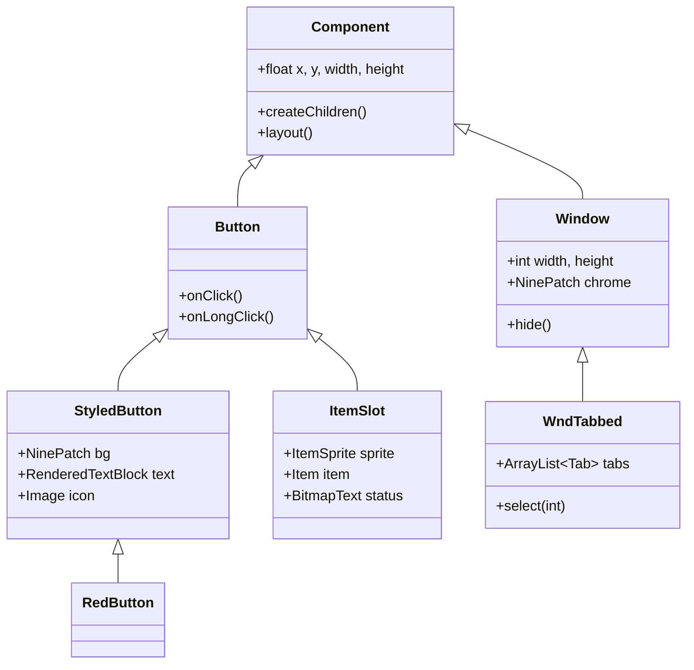
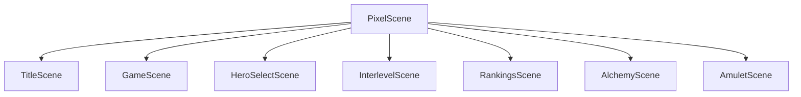

# Shattered Pixel Dungeon - UI 系统文档

## 概述

UI 系统基于 Noosa 框架（LibGDX 基础）构建，为游戏界面提供组件，包括窗口、按钮、菜单和 HUD 元素。

## 组件层次结构



## Chrome 样式系统

UI 元素的预定义视觉样式：

| 类型 | 用途 | 类型 | 用途 |
|------|-------|------|-------|
| `WINDOW` | 标准对话框 | `RED_BUTTON` | 主要按钮 |
| `WINDOW_SILVER` | 备用窗口 | `GREY_BUTTON` | 次要按钮 |
| `TOAST` | 通知框 | `TAB_SET` | 标签容器 |
| `TAB_SELECTED` | 活动标签 | `TAB_UNSELECTED` | 非活动标签 |
| `TAG` | 标签 | `GEM` | 装饰元素 |
| `SCROLL` | 滚动容器 | `BLANK` | 透明 |

## 核心组件

### 按钮系统
```java
// 基础按钮 - 重写这些以实现自定义行为
protected void onClick() {}          // 左键点击
protected void onRightClick() {}     // 右键点击
protected boolean onLongClick() {}   // 长按 (0.5s)
protected String hoverText() {}      // 工具提示

// StyledButton - 功能完整的按钮
StyledButton btn = new StyledButton(Chrome.Type.RED_BUTTON, "标签", 9);
btn.icon(new Image(Assets.Sprites.ITEM_ICONS));
btn.enable(true);

// RedButton - 预设样式的主操作按钮
RedButton btn = new RedButton("开始游戏");
```

### 物品槽位
显示带有状态指示器的物品。颜色常量：
- `DEGRADED` (0xFF4444) - 负面状态
- `UPGRADED` (0x44FF44) - 正面状态
- `WARNING` (0xFF8800) - 警告
- `ENHANCED` (0x3399FF) - 强化
- `MASTERED` (0xFFFF44) - 精通
- `CURSE_INFUSED` (0x8800FF) - 诅咒

特殊虚拟物品: `CHEST`, `LOCKED_CHEST`, `CRYSTAL_CHEST`, `TOMB`, `SKELETON`, `REMAINS`

```java
ItemSlot slot = new ItemSlot(item);
slot.item(someItem);
slot.enable(true);
```

### 生命条和游戏日志
```java
HealthBar bar = new HealthBar();
bar.level(hero);  // 显示生命值和护盾

GLog.p("正面!");  // 绿色
GLog.n("负面!");  // 红色
GLog.w("警告!");   // 橙色
GLog.h("高亮!"); // 白色
```

## 窗口系统

### 基础窗口类
```java
public class Window extends Group {
    protected int width, height;
    protected NinePatch chrome;
    protected ShadowBox shadow;
    
    public static final int WHITE = 0xFFFFFF;
    public static final int TITLE_COLOR = 0xFFFF44;
    
    public void hide();
    public void resize(int w, int h);
    public void onBackPressed();
}
```

### 窗口类型 (52 种类型)

**核心**: `Window`, `WndTabbed`, `WndMessage`, `WndOptions`, `WndTitledMessage`, `WndTextInput`

**游戏 UI**: `WndBag`, `WndHero`, `WndSettings`, `WndGame`, `WndQuickBag`, `WndJournal`

**信息窗口**: `WndInfoItem`, `WndInfoMob`, `WndInfoCell`, `WndInfoBuff`, `WndInfoTrap`, `WndInfoPlant`, `WndInfoTalent`

**对话框窗口**: `WndQuest`, `WndStory`, `WndDocument`, `WndChallenges`, `WndChooseSubclass`

**NPC 窗口**: `WndBlacksmith`, `WndWandmaker`, `WndSadGhost`, `WndImp`

**其他**: `WndRanking`, `WndBadge`, `WndDailies`, `WndCombo`, `WndMonkAbilities`, `WndClericSpells`, `WndKeyBindings`, `WndUseItem`, `WndTradeItem`, `WndUpgrade`, `WndEnergizeItem`, `WndResurrect`, `WndError`, `WndVictoryCongrats`

### WndTabbed
```java
public class WndJournal extends WndTabbed {
    @Override
    protected void createChildren() {
        super.createChildren();
        add(new LabeledTab("指南"));
        add(new LabeledTab("炼金术"));
        add(new IconTab(new Image(icon)));
        layoutTabs();
        select(0);
    }
}
```

## 场景系统



| 场景 | 用途 | 场景 | 用途 |
|-------|---------|-------|---------|
| `TitleScene` | 主菜单 | `GameScene` | 活跃游戏 |
| `HeroSelectScene` | 角色创建 | `InterlevelScene` | 加载/过渡 |
| `RankingsScene` | 高分榜 | `ChangesScene` | 更新日志 |
| `AlchemyScene` | 炼金术界面 | `AmuletScene` | 胜利 |

### 显示窗口
```java
// 在当前场景中显示窗口
GameScene.show(new WndMessage("你好!"));
GameScene.show(new WndInfoItem(item));

// 选项对话框
GameScene.show(new WndOptions("标题", "消息", "选项1", "选项2") {
    @Override
    protected void onSelect(int index) {
        if (index == 0) { /* 选项 1 */ }
    }
});
```

## 图标系统
```java
// 可用的常见图标
Icons.ENTER, Icons.GOLD, Icons.RANKINGS, Icons.WARNING,
Icons.INFO, Icons.TARGET, Icons.BUFFS, Icons.SEARCH,
Icons.INVENTORY, Icons.MENU, Icons.WAIT, Icons.CLOSE,
Icons.STAIRS, Icons.TALENT, Icons.SEED, Icons.BACKPACK

// 使用
Image icon = Icons.get(Icons.WARNING);
icon.hardlight(0xFF0000);  // 着色为红色
```

## 最佳实践

### 自定义窗口
```java
public class WndCustom extends Window {
    public WndCustom() {
        super(100, 80);
        
        RenderedTextBlock title = PixelScene.renderTextBlock("标题", 9);
        title.hardlight(TITLE_COLOR);
        add(title);
        
        RedButton btn = new RedButton("操作") {
            @Override
            protected void onClick() {
                hide();
            }
        };
        add(btn);
    }
}
```

### 布局管理
```java
@Override
protected void layout() {
    super.layout();
    title.setPos(x + 5, y + 5);
    button.setRect(x + 5, y + height - 25, width - 10, 20);
    PixelScene.align(title);
}
```

### 内存清理
```java
@Override
public void destroy() {
    super.destroy();
    KeyEvent.removeKeyListener(keyListener);
}
```