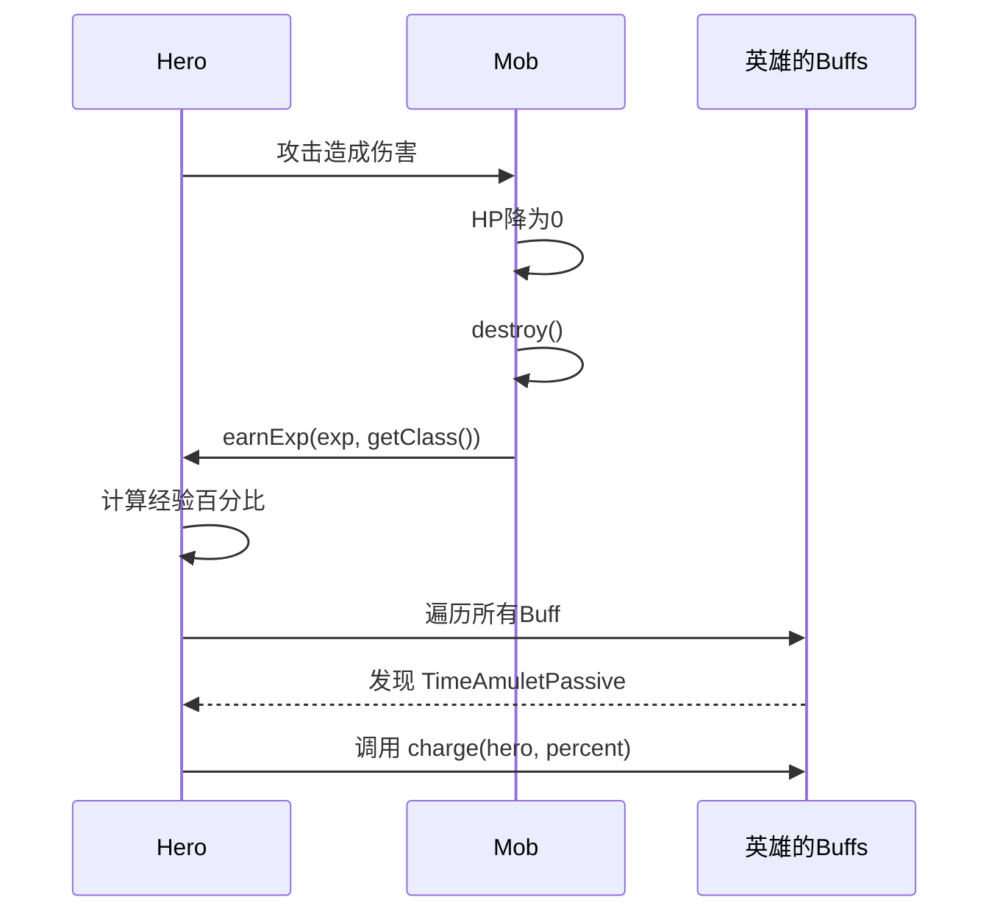

# 创建新神器教程

## 目标
完成这个教程后，你将能够创建一个自定义神器，包含被动效果、充能系统和自定义Buff。

## 前置知识
- 阅读 [Artifact API 参考](../../reference/items/artifact-api.md)
- 阅读 [Buff API 参考](../../reference/actors/buff-api.md)
- 了解 Java 基础

## 最终成果
创建一个"时间护符"神器：
- 被动效果：增加英雄10%闪避
- 主动效果：消耗充能获得短暂无敌
- 充能：每击败一个敌人获得充能

## 步骤

### 步骤1：创建神器类
**目标**：创建神器的基本框架
**文件**：`core/src/main/java/com/shatteredpixel/shatteredpixeldungeon/items/artifacts/TimeAmulet.java`
**代码**：

```java
/*
 * Pixel Dungeon
 * Copyright (C) 2012-2015 Oleg Dolya
 *
 * Shattered Pixel Dungeon
 * Copyright (C) 2014-2026 Evan Debenham
 *
 * This program is free software: you can redistribute it and/or modify
 * it under the terms of the GNU General Public License as published by
 * the Free Software Foundation, either version 3 of the License, or
 * (at your option) any later version.
 *
 * This program is distributed in the hope that it will be useful,
 * but WITHOUT ANY WARRANTY; without even the implied warranty of
 * MERCHANTABILITY or FITNESS FOR A PARTICULAR PURPOSE.  See the
 * GNU General Public License for more details.
 *
 * You should have received a copy of the GNU General Public License
 * along with this program.  If not, see <http://www.gnu.org/licenses/>
 */

package com.dustedpixel.dustedpixeldungeon.items.artifacts;

import com.dustedpixel.dustedpixeldungeon.Assets;
import com.dustedpixel.dustedpixeldungeon.Dungeon;
import com.dustedpixel.dustedpixeldungeon.actors.Char;
import com.dustedpixel.dustedpixeldungeon.actors.buffs.Buff;
import com.dustedpixel.dustedpixeldungeon.actors.buffs.MagicImmune;
import com.dustedpixel.dustedpixeldungeon.actors.hero.Hero;
import com.dustedpixel.dustedpixeldungeon.items.Item;
import com.dustedpixel.dustedpixeldungeon.messages.Messages;
import com.dustedpixel.dustedpixeldungeon.sprites.ItemSpriteSheet;
import com.dustedpixel.dustedpixeldungeon.utils.GLog;
import com.watabou.noosa.audio.Sample;
import com.watabou.utils.Bundle;
import com.watabou.utils.Random;

import java.util.ArrayList;

public class TimeAmulet extends Artifact {

    {
        image = ItemSpriteSheet.ARTIFACT_HOURGLASS; // 使用现有的沙漏图标

        exp = 0;
        levelCap = 5; // 设置最大等级为5

        charge = 0;
        partialCharge = 0;
        chargeCap = 3; // 最大充能为3

        defaultAction = AC_TIME_STOP;

        unique = true;
        bones = false;
    }

    public static final String AC_TIME_STOP = "TIME_STOP";

    @Override
    public ArrayList<String> actions(Hero hero) {
        ArrayList<String> actions = super.actions(hero);
        if (isEquipped(hero)
                && !cursed
                && hero.buff(MagicImmune.class) == null
                && (charge > 0 || activeBuff != null)) {
            actions.add(AC_TIME_STOP);
        }
        return actions;
    }

    @Override
    public void execute(Hero hero, String action) {

        super.execute(hero, action);

        if (hero.buff(MagicImmune.class) != null) return;

        if (action.equals(AC_TIME_STOP)) {

            if (activeBuff == null) {
                if (!isEquipped(hero))
                    GLog.i(Messages.get(Artifact.class, "need_to_equip"));
                else if (cursed)
                    GLog.i(Messages.get(this, "cursed"));
                else if (charge <= 0)
                    GLog.i(Messages.get(this, "no_charge"));
                else {
                    hero.spend(1f);
                    hero.busy();
                    Sample.INSTANCE.play(Assets.Sounds.TELEPORT);
                    activeBuff = activeBuff();
                    activeBuff.attachTo(hero);
                    hero.sprite.operate(hero.pos);
                }
            } else {
                activeBuff.detach();
                activeBuff = null;
                hero.sprite.operate(hero.pos);
            }

        }
    }
}
```
**说明**：这段代码创建了时间护符的基本框架。我们继承了Artifact类，设置了基本属性如图标、等级上限、充能容量等。还定义了主动能力的执行逻辑，包括检查是否装备、是否被诅咒以及是否有充能。

### 步骤2：实现被动效果
**目标**：创建被动Buff提供闪避加成
**代码**：

```java
// 在TimeAmulet类中添加以下内部类和支持代码

// 首先需要创建一个专用的闪避Buff类
// 这个类应该放在com.shatteredpixel.shatteredpixeldungeon.actors.buffs包中
// 文件名：TemporalEvasion.java

// TemporalEvasion.java的内容：
package com.dustedpixel.dustedpixeldungeon.actors.buffs;

import com.dustedpixel.dustedpixeldungeon.actors.Char;

public class TemporalEvasion extends Buff {

    private static final float DODGE_BONUS = 0.1f; // 10%闪避加成

    @Override
    public boolean attachTo(Char target) {
        if (super.attachTo(target)) {
            target.effectiveEvasionSkill += DODGE_BONUS;
            return true;
        }
        return false;
    }

    @Override
    public void detach() {
        super.detach();
        if (target != null) {
            target.effectiveEvasionSkill -= DODGE_BONUS;
        }
    }

    @Override
    public boolean act() {
        // 永久生效，不需要计时
        return true;
    }
}

// 然后在TimeAmulet类中使用这个Buff
protected TemporalEvasion evasionBuff;

public class TimeAmuletPassive extends ArtifactBuff {

    @Override
    public boolean attachTo(Char target) {
        if (super.attachTo(target)) {
            evasionBuff = new TemporalEvasion();
            evasionBuff.attachTo(target);
            return true;
        }
        return false;
    }

    @Override
    public void detach() {
        if (evasionBuff != null) {
            evasionBuff.detach();
            evasionBuff = null;
        }
        super.detach();
    }

    @Override
    public boolean act() {
        spend(TICK);
        return true;
    }
}

// 在TimeAmulet类中重写passiveBuff方法
@Override
protected ArtifactBuff passiveBuff() {
    return new TimeAmuletPassive();
}
```

### 步骤3：实现充能系统
**目标**：添加充能逻辑

**重要说明**：神器的充能是通过 `ArtifactBuff.charge()` 方法实现的。当英雄获得经验时（如击杀敌人），`Hero.earnExp()` 方法会自动调用所有已装备神器的 `charge()` 方法。详见本文档末尾的"让代码真正工作"章节。

**代码**：
```java
// 在TimeAmulet类中重写charge方法
@Override
public void charge(Hero target, float amount) {
	if (cursed || target.buff(MagicImmune.class) != null) return;

	if (charge < chargeCap) {
		partialCharge += amount;
		while (partialCharge >= 1f) {
			charge++;
			partialCharge--;
		}
		if (charge >= chargeCap) {
			partialCharge = 0;
			charge = chargeCap;
		}
		updateQuickslot();
	}
}

// ArtifactBuff内部的charge方法会委托给外部类
// 在TimeAmuletPassive内部类中：
public class TimeAmuletPassive extends ArtifactBuff {
	
	// 这个方法会在 Hero.earnExp() 中被自动调用！
	// 它会委托给外部 TimeAmulet 类的 charge() 方法
	@Override
	public void charge(Hero target, float amount) {
		TimeAmulet.this.charge(target, amount);
	}
	
	@Override
	public boolean act() {
		if (cooldown > 0)
			cooldown--;
			
		updateQuickslot();
		spend(TICK);
		return true;
	}
}
```

### 步骤4：实现主动效果
**目标**：添加使用充能的能力
**代码**：

```java
// 在TimeAmulet类中添加TemporalInvincibility内部类

import com.dustedpixel.dustedpixeldungeon.actors.buffs.Invisibility;
import com.dustedpixel.dustedpixeldungeon.ui.BuffIndicator;
import com.watabou.noosa.Image;

public class TemporalInvincibility extends ArtifactBuff {

    {
        type = buffType.POSITIVE;
        announced = true;
    }

    @Override
    public boolean attachTo(Char target) {
        if (super.attachTo(target)) {
            // 应用无敌效果 - 在Shattered Pixel Dungeon中，无敌可以通过多种方式实现
            // 我们可以给予短暂的不可见性作为视觉表示
            target.invisible++;
            return true;
        }
        return false;
    }

    @Override
    public boolean act() {
        // 主动效果持续3回合
        if (cooldown <= 0) {
            detach();
            return true;
        }

        cooldown--;

        if (cooldown == 0) {
            // 消耗充能
            charge--;
            if (charge < 0) {
                charge = 0;
            }
            updateQuickslot();
        }

        spend(TICK);
        return true;
    }

    @Override
    public void detach() {
        activeBuff = null;

        if (target.invisible > 0)
            target.invisible--;

        super.detach();
    }

    @Override
    public int icon() {
        return BuffIndicator.IMMUNITY;
    }

    @Override
    public void tintIcon(Image icon) {
        icon.hardlight(0x88CCFF); // 蓝色色调
    }

    @Override
    public String desc() {
        return Messages.get(this, "desc", cooldown);
    }
}

// 重写activeBuff方法
@Override
protected ArtifactBuff activeBuff() {
    TemporalInvincibility buff = new TemporalInvincibility();
    buff.cooldown = 3; // 无敌持续3回合
    return buff;
}
```

### 步骤5：添加视觉效果
**目标**：添加图标和发光效果
**代码**：
```java
// 图标已经在步骤1中设置：image = ItemSpriteSheet.ARTIFACT_HOURGLASS;

// 添加发光效果 - 通过override glowColor方法
@Override
public int glowColor() {
	return 0x88CCFF; // 蓝色发光
}

// 如果需要状态保存支持主动Buff
@Override
public void storeInBundle(Bundle bundle) {
	super.storeInBundle(bundle);
	if (activeBuff != null) bundle.put("buff", activeBuff);
}

@Override
public void restoreFromBundle(Bundle bundle) {
	super.restoreFromBundle(bundle);
	if (bundle.contains("buff")) {
		activeBuff = new TemporalInvincibility();
		activeBuff.restoreFromBundle(bundle.getBundle("buff"));
	}
}
```

### 步骤6：注册神器
**目标**：将神器添加到游戏中
**文件**：`core/src/main/java/com/shatteredpixel/shatteredpixeldungeon/items/Generator.java`
**代码**：

```java
// 在Generator.java的Category.ARTIFACT.classes数组中添加TimeAmulet.class
// 找到第560行左右的ARTIFACT.classes定义

// 添加导入语句（在文件顶部）：

import com.dustedpixel.dustedpixeldungeon.items.artifacts.TimeAmulet;

// 在ARTIFACT.classes数组中添加：
ARTIFACT.classes =new Class<?>[]{
AlchemistsToolkit .class,
ChaliceOfBlood .class,
CloakOfShadows .class,
DriedRose .class,
EtherealChains .class,
HolyTome .class,
HornOfPlenty .class,
MasterThievesArmband .class,
SandalsOfNature .class,
SkeletonKey .class,
TalismanOfForesight .class,
TimekeepersHourglass .class,
UnstableSpellbook .class,
TimeAmulet .class // 添加这一行
};

// 在ARTIFACT.defaultProbs数组中添加对应的概率
ARTIFACT.defaultProbs =new float[]{1,1,0,1,1,0,1,1,1,1,1,1,1,1};
// 注意：最后一个1对应TimeAmulet的概率，可以根据需要调整
```

## 完整代码

```java
/*
 * Pixel Dungeon
 * Copyright (C) 2012-2015 Oleg Dolya
 *
 * Shattered Pixel Dungeon
 * Copyright (C) 2014-2026 Evan Debenham
 *
 * This program is free software: you can redistribute it and/or modify
 * it under the terms of the GNU General Public License as published by
 * the Free Software Foundation, either version 3 of the License, or
 * (at your option) any later version.
 *
 * This program is distributed in the hope that it will be useful,
 * but WITHOUT ANY WARRANTY; without even the implied warranty of
 * MERCHANTABILITY or FITNESS FOR A PARTICULAR PURPOSE.  See the
 * GNU General Public License for more details.
 *
 * You should have received a copy of the GNU General Public License
 * along with this program.  If not, see <http://www.gnu.org/licenses/>
 */

package com.dustedpixel.dustedpixeldungeon.items.artifacts;

import com.dustedpixel.dustedpixeldungeon.Assets;
import com.dustedpixel.dustedpixeldungeon.Dungeon;
import com.dustedpixel.dustedpixeldungeon.actors.Char;
import com.dustedpixel.dustedpixeldungeon.actors.buffs.Buff;
import com.dustedpixel.dustedpixeldungeon.actors.buffs.MagicImmune;
import com.dustedpixel.dustedpixeldungeon.actors.hero.Hero;
import com.dustedpixel.dustedpixeldungeon.items.Item;
import com.dustedpixel.dustedpixeldungeon.messages.Messages;
import com.dustedpixel.dustedpixeldungeon.sprites.ItemSpriteSheet;
import com.dustedpixel.dustedpixeldungeon.ui.BuffIndicator;
import com.dustedpixel.dustedpixeldungeon.utils.GLog;
import com.watabou.noosa.Image;
import com.watabou.noosa.audio.Sample;
import com.watabou.utils.Bundle;
import com.watabou.utils.Random;

import java.util.ArrayList;

public class TimeAmulet extends Artifact {

    {
        image = ItemSpriteSheet.ARTIFACT_HOURGLASS;

        exp = 0;
        levelCap = 5;

        charge = 0;
        partialCharge = 0;
        chargeCap = 3;

        defaultAction = AC_TIME_STOP;

        unique = true;
        bones = false;
    }

    public static final String AC_TIME_STOP = "TIME_STOP";

    @Override
    public ArrayList<String> actions(Hero hero) {
        ArrayList<String> actions = super.actions(hero);
        if (isEquipped(hero)
                && !cursed
                && hero.buff(MagicImmune.class) == null
                && (charge > 0 || activeBuff != null)) {
            actions.add(AC_TIME_STOP);
        }
        return actions;
    }

    @Override
    public void execute(Hero hero, String action) {

        super.execute(hero, action);

        if (hero.buff(MagicImmune.class) != null) return;

        if (action.equals(AC_TIME_STOP)) {

            if (activeBuff == null) {
                if (!isEquipped(hero))
                    GLog.i(Messages.get(Artifact.class, "need_to_equip"));
                else if (cursed)
                    GLog.i(Messages.get(this, "cursed"));
                else if (charge <= 0)
                    GLog.i(Messages.get(this, "no_charge"));
                else {
                    hero.spend(1f);
                    hero.busy();
                    Sample.INSTANCE.play(Assets.Sounds.TELEPORT);
                    activeBuff = activeBuff();
                    activeBuff.attachTo(hero);
                    hero.sprite.operate(hero.pos);
                }
            } else {
                activeBuff.detach();
                activeBuff = null;
                hero.sprite.operate(hero.pos);
            }

        }
    }

    @Override
    protected ArtifactBuff passiveBuff() {
        return new TimeAmuletPassive();
    }

    @Override
    protected ArtifactBuff activeBuff() {
        TemporalInvincibility buff = new TemporalInvincibility();
        buff.cooldown = 3;
        return buff;
    }

    @Override
    public void charge(Hero target, float amount) {
        if (cursed || target.buff(MagicImmune.class) != null) return;

        if (charge < chargeCap) {
            partialCharge += amount;
            while (partialCharge >= 1f) {
                charge++;
                partialCharge--;
            }
            if (charge >= chargeCap) {
                partialCharge = 0;
                charge = chargeCap;
            }
            updateQuickslot();
        }
    }

    @Override
    public int glowColor() {
        return 0x88CCFF;
    }

    public class TimeAmuletPassive extends ArtifactBuff {

        // 关键：重写charge方法，这个方法会在Hero.earnExp()中被自动调用
        @Override
        public void charge(Hero target, float amount) {
            TimeAmulet.this.charge(target, amount);
        }

        @Override
        public boolean act() {
            if (cooldown > 0)
                cooldown--;

            updateQuickslot();
            spend(TICK);
            return true;
        }
    }

    public class TemporalInvincibility extends ArtifactBuff {

        {
            type = buffType.POSITIVE;
            announced = true;
        }

        @Override
        public boolean attachTo(Char target) {
            if (super.attachTo(target)) {
                target.invisible++;
                return true;
            }
            return false;
        }

        @Override
        public boolean act() {
            if (cooldown <= 0) {
                detach();
                return true;
            }

            cooldown--;

            if (cooldown == 0) {
                charge--;
                if (charge < 0) {
                    charge = 0;
                }
                updateQuickslot();
            }

            spend(TICK);
            return true;
        }

        @Override
        public void detach() {
            activeBuff = null;

            if (target.invisible > 0)
                target.invisible--;

            super.detach();
        }

        @Override
        public int icon() {
            return BuffIndicator.IMMUNITY;
        }

        @Override
        public void tintIcon(Image icon) {
            icon.hardlight(0x88CCFF);
        }

        @Override
        public String desc() {
            return Messages.get(this, "desc", cooldown);
        }
    }

    @Override
    public void storeInBundle(Bundle bundle) {
        super.storeInBundle(bundle);
        if (activeBuff != null) bundle.put("buff", activeBuff);
    }

    @Override
    public void restoreFromBundle(Bundle bundle) {
        super.restoreFromBundle(bundle);
        if (bundle.contains("buff")) {
            activeBuff = new TemporalInvincibility();
            activeBuff.restoreFromBundle(bundle.getBundle("buff"));
        }
    }

    @Override
    public Item random() {
        // 30% chance to be cursed
        if (Random.Float() < 0.3f) {
            cursed = true;
        }
        return this;
    }
}
```

## 测试验证
1. 启动游戏
2. 使用调试功能获得神器（按F4打开控制台，输入`give TimeAmulet`）
3. 验证被动效果生效（检查英雄信息面板中的闪避值是否增加）
4. 验证充能系统工作（击败敌人后观察充能条是否增长）
5. 验证主动效果工作（使用主动能力后，确认获得无敌效果并消耗充能）

## 进阶修改
- **添加升级效果**：随着神器等级提升，增加充能容量或减少主动能力冷却时间
- **添加自定义精灵图**：创建专用的图标和动画效果
- **平衡性调整**：根据游戏测试调整充能获取速度、主动效果持续时间等参数
- **添加音效**：为充能和主动效果添加独特的音效
- **添加视觉反馈**：在玩家获得充能或使用能力时显示特殊效果

## 重要：让代码真正工作

### 充能机制原理

本教程中创建的"时间护符"的充能机制基于以下调用链：



### 为什么教程中的充能代码能工作

1. **被动Buff附加**：当神器被装备时，`passiveBuff()` 返回的 `TimeAmuletPassive` Buff会自动附加到英雄身上

2. **经验触发充能**：当英雄获得经验时（如击杀敌人），`Hero.earnExp()` 方法会调用所有 `ArtifactBuff` 的 `charge()` 方法

3. **充能方法实现**：我们重写的 `charge(Hero, float)` 方法定义了充能的具体行为

### 关键源码位置

**Mob.java 第866行** - 敌人死亡时调用 earnExp：
```java
Dungeon.hero.earnExp(exp, getClass());
```

**Hero.java 第1967-1992行** - earnExp() 中触发充能：
```java
public void earnExp( int exp, Class source ) {
    float percent = exp/(float)maxExp();
    
    // 调用特定神器的充能方法
    HornOfPlenty.hornRecharge horn = buff(HornOfPlenty.hornRecharge.class);
    if (horn != null) horn.gainCharge(percent);
    
    AlchemistsToolkit.kitEnergy kit = buff(AlchemistsToolkit.kitEnergy.class);
    if (kit != null) kit.gainCharge(percent);
    
    // 遍历所有物品调用 onHeroGainExp
    for (Item i : belongings) {
        i.onHeroGainExp(percent, this);
    }
}
```

### ⚠️ 常见错误：自定义触发方法不会被调用

**错误方式**：
```java
// 这个方法永远不会被调用！游戏没有任何地方会调用它
public void onEnemyDefeated() {
    charge(Dungeon.hero, 1f);
}
```

**正确方式**：重写 `charge()` 方法或实现 `ArtifactBuff.charge()`

### 其他充能触发方式

如果你的神器需要特殊的充能触发条件（不是基于经验），你可以：

**方式1：通过防御回调（受到伤害时充能）**
```java
public class DamageChargeBuff extends ArtifactBuff {
    @Override
    public int defenseProc(Char enemy, int damage) {
        if (!isCursed() && charge < chargeCap && damage > 0) {
            partialCharge += damage * 0.1f;
            while (partialCharge >= 1 && charge < chargeCap) {
                partialCharge--;
                charge++;
            }
            updateQuickslot();
        }
        return damage;
    }
}
```

**方式2：通过攻击回调（攻击命中时充能）**
```java
public class AttackChargeBuff extends ArtifactBuff {
    @Override
    public int attackProc(Char enemy, int damage) {
        if (!isCursed() && charge < chargeCap) {
            partialCharge += 0.5f;
            // ...
        }
        return damage;
    }
}
```

**方式3：通过 Item.onHeroGainExp() 接口**
```java
@Override
public void onHeroGainExp(float levelPercent, Hero hero) {
    if (isEquipped(hero) && !cursed) {
        partialCharge += levelPercent;
        // ...
    }
}
```

### 验证充能是否工作

添加日志来验证：
```java
@Override
public void charge(Hero target, float amount) {
    GLog.i("charge() called with amount: " + amount);  // 应该看到这条日志
    // ... 充能逻辑
}
```

如果看不到日志，说明：
1. 神器没有正确装备
2. `passiveBuff()` 返回了 null
3. Buff 没有正确附加到英雄身上

---

## 常见问题

Q: 充能不增长怎么办？
A: 检查 `charge()` 方法是否被正确实现。确保 `ArtifactBuff.charge()` 方法正确委托给外部类。使用日志验证方法是否被调用。

Q: 被动效果不生效怎么办？
A: 确认 `passiveBuff()` 返回非null，并且 `attachTo()` 返回 true。检查 Buff 是否正确添加到英雄的 Buff 列表中。

Q: 主动效果无法使用怎么办？
A: 检查 `actions()` 方法是否正确返回了主动能力名称，并确保 `execute()` 方法正确处理该动作。

Q: 游戏崩溃或报错怎么办？
A: 检查所有导入的包是否正确，确保引用的类和方法存在于代码库中。特别注意 BuffIndicator 常量和 Assets 音效路径。

---

## 相关资源

- [游戏生命周期与集成指南](../../integration/game-lifecycle-guide.md) - 详细解释调用链和集成机制
- [Artifact API 参考](../../reference/items/artifact-api.md) - 神器类完整API文档
- [Buff API 参考](../../reference/actors/buff-api.md) - Buff类完整API文档
- [调试工作流程](../../integration/debugging-workflow.md) - 常见问题诊断方法